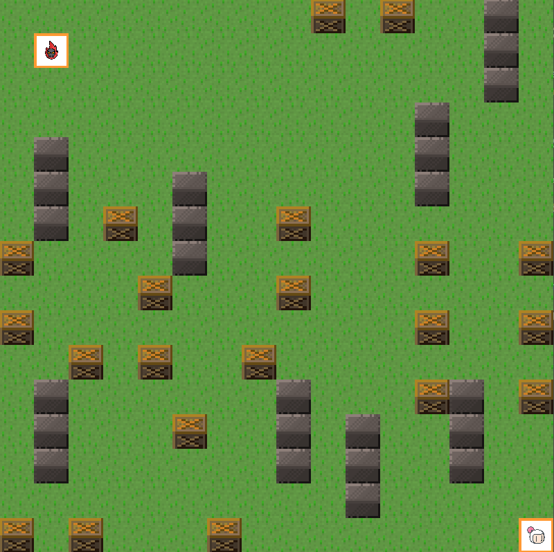
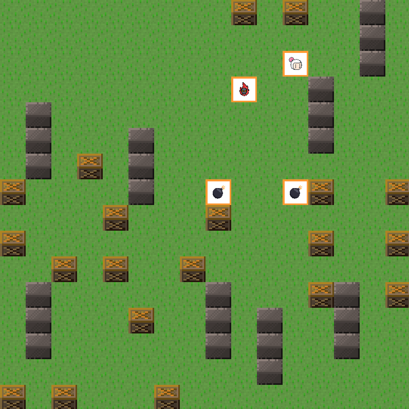
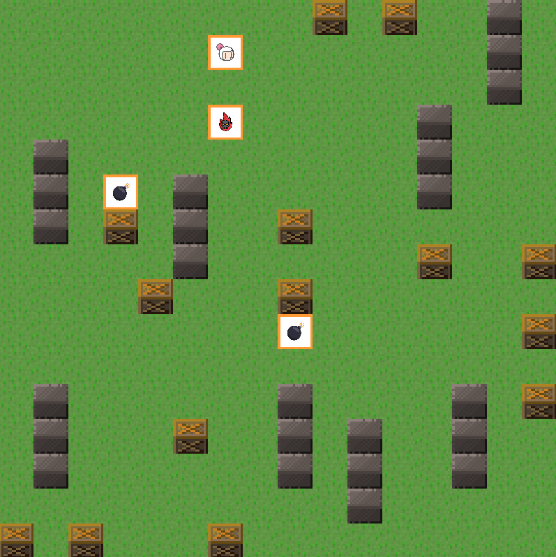

<div id="top"></div>
<!--
*** Thanks for checking out the Best-README-Template. If you have a suggestion
*** that would make this better, please fork the repo and create a pull request
*** or simply open an issue with the tag "enhancement".
*** Don't forget to give the project a star!
*** Thanks again! Now go create something AMAZING! :D
-->


<!-- PROJECT SHIELDS -->
<!--
*** I'm using markdown "reference style" links for readability.
*** Reference links are enclosed in brackets [ ] instead of parentheses ( ).
*** See the bottom of this document for the declaration of the reference variables
*** for contributors-url, forks-url, etc. This is an optional, concise syntax you may use.
*** https://www.markdownguide.org/basic-syntax/#reference-style-links
-->
[![Contributors][contributors-shield]][contributors-url]
[![Forks][forks-shield]][forks-url]
[![Stargazers][stars-shield]][stars-url]
[![Issues][issues-shield]][issues-url]
[![MIT License][license-shield]][license-url]
[![LinkedIn][linkedin-shield]][linkedin-url]


<!-- PROJECT LOGO -->
<br />
<div align="center">
  <a href="https://github.com/MarioAvolio/Artificial-Intelligence-for-Bomberman-Game">
    
  </a>

<h3 align="center">Bomberman AI in ASP</h3>

  <p align="center">
    Simple Bomberman clone written in python using pygame and ASP.
    <br />
    <a href="https://github.com/MarioAvolio/Artificial-Intelligence-for-Bomberman-Game"><strong>Explore the docs »</strong></a>
    <br />
    <br />
    <a href="https://github.com/MarioAvolio/Artificial-Intelligence-for-Bomberman-Game">View Demo</a>
    ·
    <a href="https://github.com/MarioAvolio/Artificial-Intelligence-for-Bomberman-Game/issues">Report Bug</a>
    ·
    <a href="https://github.com/MarioAvolio/Artificial-Intelligence-for-Bomberman-Game/issues">Request Feature</a>
  </p>
</div>


<!-- TABLE OF CONTENTS -->
<details>
  <summary>Table of Contents</summary>
  <ol>
    <li>
      <a href="#about-the-project">About The Project</a>
      <ul>
        <li><a href="#built-with">Built With</a></li>
      </ul>
    </li>
    <li>
      <a href="#getting-started">Getting Started</a>
      <ul>
        <li><a href="#prerequisites">Prerequisites</a></li>
        <li><a href="#installation">Installation</a></li>
      </ul>
    </li>
    <li><a href="#usage">Usage</a></li>
    <li><a href="#roadmap">Roadmap</a></li>
    <li><a href="#contributing">Contributing</a></li>
    <li><a href="#license">License</a></li>
    <li><a href="#contact">Contact</a></li>
    <li><a href="#acknowledgments">Acknowledgments</a></li>
  </ol>
</details>


<!-- ABOUT THE PROJECT -->
## About The Project

[![Product Name Screen Shot][product-screenshot]](https://example.com)

**Simple** Bomberman clone written in python using pygame. 
- **ASP** for Artificial Intelligence, indeed, the system is based on **DLV2**.
- **Multithreading** game based on **RWLock**.
- Easy graphics with **PyGame**.
- Supported **platforms**: _Windows_, _Linux_, _MacOS_

<p align="right">(<a href="#top">back to top</a>)</p>


### Built With

* [Python](https://www.python.org/)
* [DLV2](https://dlv.demacs.unical.it/)


<p align="right">(<a href="#top">back to top</a>)</p>


<!-- GETTING STARTED -->
## Getting Started

This is an example of how you may give instructions on setting up your project locally.
To get a local copy up and running follow these simple example steps.

### Prerequisites

* Python
* Pygame
* ANTLR4 4.7
  ```sh
    python /lib/installer.py 
  ```

### Installation
1. Clone the repo
   ```sh
   git clone https://github.com/MarioAvolio/Artificial-Intelligence-for-Bomberman-Game.git
   ```

<p align="right">(<a href="#top">back to top</a>)</p>


<!-- USAGE EXAMPLES -->
## Usage

### Capture 1


### Capture 2


### Capture 3

  
### Controls 
- Arrows - move 
- Space - plant bomb 
- Esc - exit

<p align="right">(<a href="#top">back to top</a>)</p>

<!-- ROADMAP -->
## Roadmap
- [X] Artificial Intelligence in ASP
- [X] Simple Graphics in PyGame

See the [open issues](https://github.com/MarioAvolio/Artificial-Intelligence-for-Bomberman-Game/issues) for a full list of proposed features (and known issues).

<p align="right">(<a href="#top">back to top</a>)</p>


<!-- CONTRIBUTING -->
## Contributing

Contributions are what make the open source community such an amazing place to learn, inspire, and create. Any contributions you make are **greatly appreciated**.

If you have a suggestion that would make this better, please fork the repo and create a pull request. You can also simply open an issue with the tag "enhancement".
Don't forget to give the project a star! Thanks again!

1. Fork the Project
2. Create your Feature Branch (`git checkout -b feature/AmazingFeature`)
3. Commit your Changes (`git commit -m 'Add some AmazingFeature'`)
4. Push to the Branch (`git push origin feature/AmazingFeature`)
5. Open a Pull Request

<p align="right">(<a href="#top">back to top</a>)</p>


<!-- LICENSE -->
## License

Distributed under the MIT License. See `LICENSE` for more information.

<p align="right">(<a href="#top">back to top</a>)</p>


<!-- CONTACT -->
## Contact
Mario Avolio - marioavolio@protonmail.com

Project Link: [https://github.com/MarioAvolio/Artificial-Intelligence-for-Bomberman-Game](https://github.com/MarioAvolio/Artificial-Intelligence-for-Bomberman-Game)

<p align="right">(<a href="#top">back to top</a>)</p>

<!-- ACKNOWLEDGMENTS -->
## Acknowledgments

* [sprites](https://opengameart.org/content/bomb-party-the-complete-set)
* [icon](https://www.flaticon.com/free-icon/bomberman_528079?term=bomberman&page=1&position=1&page=1&position=1&related_id=528079&origin=style)
* [icon](https://www.flaticon.com/free-icon/enemy_1477179?term=enemy&page=1&position=1&page=1&position=1&related_id=1477179&origin=search)
* [icon](https://www.flaticon.com/free-icon/bomb_595582?term=bomb&page=1&position=2&page=1&position=2&related_id=595582&origin=search)
* [Wallpaper](https://wallpapercave.com/w/wp3539078)

<p align="right">(<a href="#top">back to top</a>)</p>


<!-- MARKDOWN LINKS & IMAGES -->
<!-- https://www.markdownguide.org/basic-syntax/#reference-style-links -->
[contributors-shield]: https://img.shields.io/github/contributors/MarioAvolio/Artificial-Intelligence-for-Bomberman-Game.svg?style=for-the-badge
[contributors-url]: https://github.com/MarioAvolio/Artificial-Intelligence-for-Bomberman-Game/graphs/contributors
[forks-shield]: https://img.shields.io/github/forks/MarioAvolio/Artificial-Intelligence-for-Bomberman-Game.svg?style=for-the-badge
[forks-url]: https://github.com/MarioAvolio/Artificial-Intelligence-for-Bomberman-Game/network/members
[stars-shield]: https://img.shields.io/github/stars/MarioAvolio/Artificial-Intelligence-for-Bomberman-Game.svg?style=for-the-badge
[stars-url]: https://github.com/MarioAvolio/Artificial-Intelligence-for-Bomberman-Game/stargazers
[issues-shield]: https://img.shields.io/github/issues/MarioAvolio/Artificial-Intelligence-for-Bomberman-Game.svg?style=for-the-badge
[issues-url]: https://github.com/MarioAvolio/Artificial-Intelligence-for-Bomberman-Game/issues
[license-shield]: https://img.shields.io/github/license/MarioAvolio/Artificial-Intelligence-for-Bomberman-Game.svg?style=for-the-badge
[license-url]: https://github.com/MarioAvolio/Artificial-Intelligence-for-Bomberman-Game/blob/master/LICENSE
[linkedin-shield]: https://img.shields.io/badge/-LinkedIn-black.svg?style=for-the-badge&logo=linkedin&colorB=555
[linkedin-url]: https://www.linkedin.com/in/mario-avolio-3666b1219/
[product-screenshot]: images/screenshot.png
